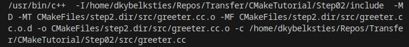
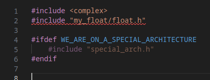
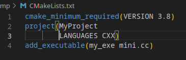
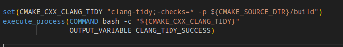
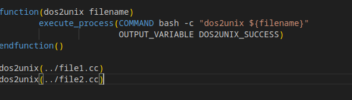
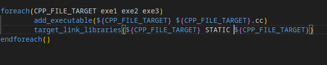
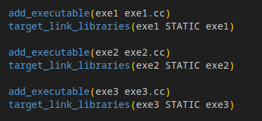

# CMake - The Build System for Modern C++

## Overview
CMake is a cross-platform, open-source build system that simplifies building C++ projects across different operating systems and compilers.

## Key Features
- **Cross-platform**: Works on Linux, Windows, macOS
- **Compiler-agnostic**: Supports GCC, Clang, MSVC, and more
- **Simple syntax**: Easy-to-read CMakeLists.txt files
- **Dependency management**: Handles project dependencies efficiently

## Background
- C++ is a compiled language as opposed to interpreted language (like Python, bash)
- A C++ compiler translates a C++-text into native binary (assembly)
- 4 phases
    - Pre-compile
    - Compile
    - Assemble
    - Link

## Why do we need a build system for C++?
- Keep C++ code as compact/succinct as possible
- Additional information is needed to compile from C++-text to binary
- Additional information can be complex, and there can be a lot of it
- For example command-line to compile 1 file into an object file: 

- Lots of parameters, configurations to pass, used for different phases of the compilation process

### When does the _**pre-compiler**_ need parameters?
- The pre-compiler recursively replaces #include instructions with contents of files.
- The #include instructions are usually only filenames, sometimes with relative paths. So where do we find these files?
- Variable definitions/references in code
- pass flags conditionally to influence what and how an executable is built



### When does the _**compiler**_ need parameters?
- Which C++ standard to use (compile against)
- Compile for performance or debug
- Whether to compile for different architecture (cross-compile)
- Whether to treat warnings as errors
- Output location for compiled (object) files
- …

**Remember**: Command parameters need to be added for every single file that is compiled.

### When does the _**linker**_ need parameters?
- The input for the linker are the object files created by the compiler, plus (static or dynamic) libraries, so we need locations for all the files
- Symbolic or static linkage
- Location of linker to use
- ...

### Summary
In summary need to instruct our compiler:
- Where to find files/headers/libraries – this can be lots of different folders
- Attributes we want our executable to have
    - Create debuggable binary?
    - high-performant?
    - Create for a different hardware (cross-compile)?
    - Dynamic/static?
    - ...
- Use external tools or pre-compilers (eg. lex/yacc)?
- This information is usually given as parameters to the compile command
    - `-I`: include path
    - `-D`: variable definition
    - `-o`: output filename
    - `-L`: library directory
    - `-Wall`: turn on all warnings
    - ...

## History

Traditionally we used `Makefile`s, which were the de-facto standard on Posix systems.
- In the `Makefile`s we declared `targets` and a `recipe` for how to build each target.
- To make this process a bit more general we could define
    - variables (much like shell-variables)
    - Dependencies
    - General recipes

This was very cumbersome end error prone.

The next step up was a tool-collection known as `autotools`.

Whilst Microsoft (in VisualStudio) used visual tools to define XML documents to simplify the creation of Makefiles,
Unix/Linux used `autotools` (automake,...). `Autotools` would search standard directories to find:
- “Known” directories, and whether and where specific libraries and tools are installed 
- Whether and where specific headers are installed
- Check capabilities of compiler and linker, like C++-standard etc.

Autotools worked and made things easier, but remained a **dark art** for many.

## CMake
For a few years now `cmake` has been the weapon of choice to define and configure builds of C++ projects.
- Similar in approach to the way `autotools` works
- Generates Makefiles or Ninja files
- Text-based
- Descriptive
- Well-documented
- Powerful
- Well maintained and community supported

### Minimal example
File `CMakeLists.txt`: Naming is important, case-sensitive



- If the C++ file mini.cc exists and is a valid C++-program source, this would be sufficient to build a simple executable with cmake
- The executable would be called my_exe.

### Variables and functions
CMake is highly customisable and can be tailored to specific needs. Whilst already a huge number of tools and external systems are
supported, you can add recipies for your private tools if need be.

The simplest way to modify CMake's behaviour is to add/change variables: 
```cmake
set(<variable-name> <variable-value>)
```


Functions can be defined and called to perform user-tasks:
```cmake
function(<function-name> [parameter] [...])
```



### Flow-control
There are several ways to control the flow of builds, like conditional steps and iterations. We won't go into that in this
primer, but we show an example to show the power of flow-control in CMake.

One way to iterate in CMake is the `foreach` instruction:
```cmake
foreach(<iteration-var> <enum1> <enum2> ...)
...
endforeach()
```
For example:



is equivalent to:



## Where to find help?
- String operations: https://cmake.org/cmake/help/latest/command/string.html
- If-then-else: https://cmake.org/cmake/help/latest/command/if.html
- Find libraries: https://cmake.org/cmake/help/latest/command/find_library.html
- Find a program: https://cmake.org/cmake/help/latest/command/find_program.html
- Run bash commands: https://cmake.org/cmake/help/v3.0/command/execute_process.html
- and more...

## Exercises

Follow these step-by-step tutorials to learn CMake:

- [Step 1: Explore the directory and use make/CMake](Step01/__INSTRUCTIONS__.md) - Basic compilation with `make` and introduction to CMakeLists.txt
- [Step 2: Better project structure with headers and sources](Step02/__INSTRUCTIONS__.md) - Organizing code into `include/` and `src/` folders
- [Step 3: Subdirectories and modular CMake](Step03/__INSTRUCTIONS__.md) - Using `add_subdirectory()` for better organization
- [Step 4: Creating and linking libraries](Step04/__INSTRUCTIONS__.md) - Building static libraries with `add_library()` and `target_link_libraries()`
- [Step 5: Customizing build output directories](Step05/__INSTRUCTIONS__.md) - Organizing build artifacts with CMAKE_*_OUTPUT_DIRECTORY variables
- [Step 6: Finding and using external libraries](Step06/__INSTRUCTIONS__.md) - Locating pre-built libraries with `find_library()`
- [Step 7: Build configurations (Debug vs Release)](Step07/__INSTRUCTIONS__.md) - Creating different build types with compile flags and optimizations
