# Memory in C++

## Program Memory Model

The following diagram illustrates how memory is organized in a C++ program:

```mermaid
%%{init: {'flowchart': {'htmlLabels': true, 'fontSize': 18}, 'theme': 'default'}}%%
graph TD
    A["<b style='font-size: 20px'>HIGH ADDRESSES</b><br/><b>(0xFFFFFFFF)</b>"]
    
    C7["<b style='font-size: 18px'>ENVIRONMENT</b><br/>Environment variables<br/>Command-line arguments<br/>Program arguments"]
    
    C6["<b style='font-size: 18px'>STACK</b><br/>Function parameters<br/>Local variables<br/>Return addresses<br/>↓ GROWS DOWNWARD ↓"]
    
    C5["<b style='font-size: 18px'>FREE SPACE</b><br/>(Unallocated Memory)"]
    
    C4["<b style='font-size: 18px'>HEAP</b><br/>Dynamic memory allocation<br/>malloc / new<br/>↑ GROWS UPWARD ↑"]
    
    C3["<b style='font-size: 18px'>BSS SEGMENT</b><br/>Uninitialized global & static variables<br/>Automatically zeroed at startup<br/>Does not increase file size"]
    
    C2["<b style='font-size: 18px'>DATA SEGMENT</b><br/>Initialized global & static variables<br/>Read-write memory<br/>Fixed size at compile time"]
    
    C1["<b style='font-size: 18px'>CODE/TEXT SEGMENT</b><br/>Executable machine instructions<br/>Read-only memory<br/>Fixed size at compile time"]
    
    Z["<b style='font-size: 20px'>LOW ADDRESSES</b><br/><b>(0x00000000)</b>"]
    
    A --> C7 --> C6 --> C5 --> C4 --> C3 --> C2 --> C1 --> Z
    
    style A fill:#cccccc,stroke:#333,stroke-width:3px,color:#000
    style Z fill:#cccccc,stroke:#333,stroke-width:3px,color:#000
    style C1 fill:#e1f5ff,stroke:#0277bd,stroke-width:2px,color:#000
    style C2 fill:#f3e5f5,stroke:#6a1b9a,stroke-width:2px,color:#000
    style C3 fill:#f3e5f5,stroke:#6a1b9a,stroke-width:2px,color:#000
    style C4 fill:#fff3e0,stroke:#e65100,stroke-width:2px,color:#000
    style C5 fill:#f5f5f5,stroke:#424242,stroke-width:2px,color:#000
    style C6 fill:#e8f5e9,stroke:#1b5e20,stroke-width:2px,color:#000
    style C7 fill:#fce4ec,stroke:#880e4f,stroke-width:2px,color:#000
```



## Memory Segments Explained

### 1. **Code/Text Segment**
- Contains executable machine code
- Read-only memory
- Size is fixed at compile time
- Shared among multiple instances of the program

### 2. **Data Segment (Initialized Data)**
- Global and static variables that are explicitly initialized
- Has initial values determined at compile time
- Size is fixed at program startup

### 3. **BSS Segment (Uninitialized Data)**
- Global and static variables without explicit initialization
- Automatically zeroed at program startup
- Doesn't increase executable file size
- BSS = "Block Started by Symbol"

### 4. **Heap**
- Dynamic memory allocation region
- Memory allocated with `new` or `malloc()`
- Grows upward toward free space
- Must be manually deallocated (or use smart pointers)
- Larger but slower to allocate than stack
- No automatic cleanup

### 5. **Stack**
- Automatic memory for local variables and function parameters
- Grows downward toward free space
- Last-In-First-Out (LIFO) structure
- Automatic cleanup when variables go out of scope
- Faster than heap
- Limited size (can cause stack overflow)
- Functions' return addresses stored here

### 6. **Environment**
- Command-line arguments
- Environment variables

## Key Differences: Stack vs Heap

| Feature | Stack | Heap |
|---------|-------|------|
| **Allocation** | Automatic | Manual (new/malloc) |
| **Speed** | Very fast | Slower |
| **Size** | Limited | Larger, limited by RAM |
| **Lifetime** | Automatic cleanup | Manual cleanup needed |
| **Access** | Thread-local | Shared across threads |
| **Fragmentation** | None | Can become fragmented |
| **Thread Safety** | Thread-safe | Requires synchronization |

## Example

```cpp
int globalVar = 10;              // Data segment
static int staticVar;            // BSS segment

int main() {
    int localVar = 5;            // Stack
    int* ptrVar = new int(20);   // Stack pointer, heap value
    
    delete ptrVar;               // Free heap memory
    return 0;                    // Stack cleaned up
}
```

- `globalVar`: Data segment (initialized)
- `staticVar`: BSS segment (uninitialized, set to 0)
- `localVar`: Stack
- `ptrVar` pointer: Stack
- `ptrVar` value (20): Heap
