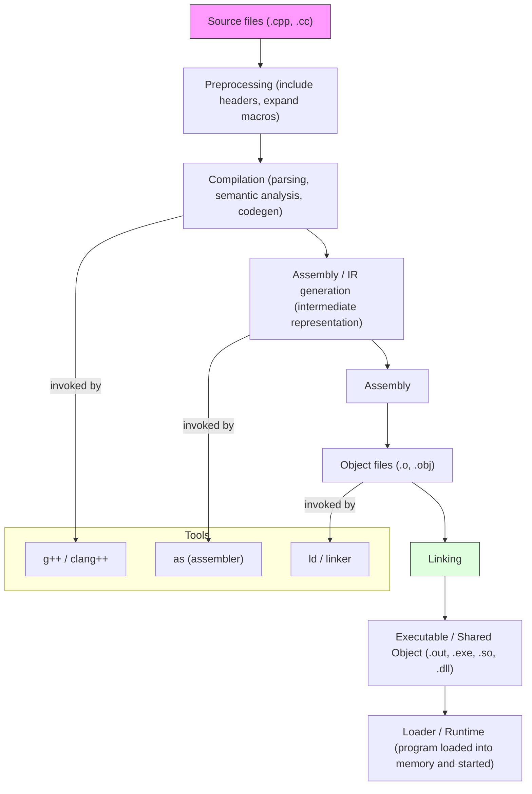

# C++ Compilation Process

The diagram below shows the main stages a C++ source file goes through to become an executable.

Notes:

- Preprocessing produces a translation unit (source with headers expanded).
- The compilation stage performs parsing, semantic analysis, and code generation (often producing assembly or IR).
- Assembly turns assembly/IR into object files.
- The linker combines object files and libraries (static or dynamic) to produce the final executable or shared object.
- The loader/runtime loads the executable into memory and performs dynamic linking if needed.

